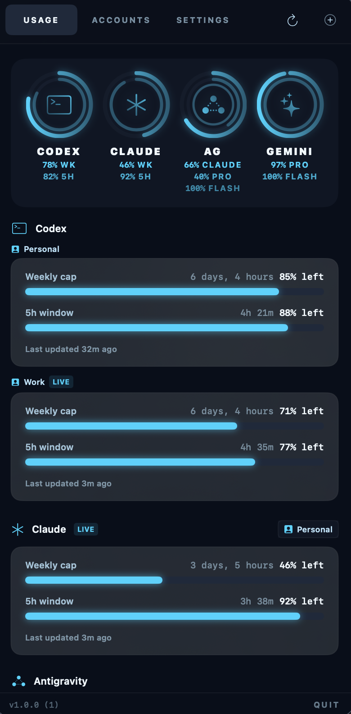

# TokenGuard

**TokenGuard** is a macOS menu bar utility for developers who want one quick view of local AI tool usage, remaining capacity, and reset timing.

Rather than asking for API keys or cloud syncing, TokenGuard reads local state from the CLIs and apps you already use, then turns that scattered usage data into a compact menu bar popover.

*Note: TokenGuard is an independent developer utility and is not affiliated with, endorsed by, or sponsored by OpenAI, Anthropic, or any other AI service provider.*



## Why it earns a spot in your menu bar

- One glance to see remaining capacity across Codex, Claude, Gemini CLI, and Antigravity.
- Remaining-time windows and reset timing where local provider state exposes them.
- Local-first account tracking with no analytics, hosted dashboard, or extra API setup.
- Best for developers who actively switch between AI tools and want fast operational visibility.

## What the app gives you

- A compact global hero view for quick usage scans.
- Per-account cards with remaining capacity, reset timing, and freshness state.
- Multi-account support with active-account detection where local provider state makes that possible.

## What it does

- Shows a menu bar dashboard for AI usage windows and reset timing.
- Tracks remaining capacity for supported local providers where usage data is available.
- Supports multiple local accounts and detects the active account where possible.
- Stores TokenGuard account metadata locally and app-managed credentials in Keychain.
- Avoids analytics, cloud sync, and third-party usage collection.

## Who is this for?

Developers and power users who rely on multiple AI tools and want a lightweight, local-first way to keep track of usage without opening several dashboards or running provider-specific commands.

## Why does it exist?

AI coding tools expose usage in different places. Some usage lives in local CLI state, some in app state, and some behind provider-specific interfaces. TokenGuard gives you a single local view without requiring separate API keys or a hosted account.

## Supported Providers

- **Claude Code**: Tracks local Claude Code usage windows from local session state.
- **Codex**: Tracks active Codex account/session usage and plan windows from local state.
- **Gemini CLI**: Tracks local Gemini CLI usage limits for the signed-in local account.
- **Antigravity**: Tracks local Antigravity usage state.

## Installation

The source repo is public now. Prebuilt app releases will be published through [GitHub Releases](https://github.com/pavelalbawork/TokenGuard/releases) once the first downloadable package is ready.

Until then, build from source using the steps below.

## Setup & Prerequisites

Because TokenGuard relies on local provider state, **the corresponding provider CLI or app must already be installed and signed in on your Mac.**

- To track Claude Code, sign in locally with the Claude Code CLI/app.
- To track Codex, sign in locally with Codex.
- To track Gemini CLI, sign in locally with Gemini CLI.
- To track Antigravity, make sure its local state is available on this Mac.

*TokenGuard does not log you in to these services; it only reads the state they leave behind.*

## How account setup works

Adding an account is a validation step, not just a label form.

1. Choose the provider you want to track.
2. Enter the email or identifier shown by the currently signed-in local provider.
3. TokenGuard checks the provider's local state before saving the account.
4. If the local account does not match what you entered, the account is rejected instead of creating a dead placeholder entry.

For consumer providers, TokenGuard only refreshes the currently active local account for that service. You can keep multiple saved accounts, but inactive ones are treated as saved references until you switch the local provider login.

### Claude Code Keychain access

Claude Code tracking depends on local Claude state and a Claude-owned Keychain item. macOS may ask you to grant TokenGuard access to that Keychain entry the first time Claude usage is read.

If macOS does not remember that approval, the prompt can show up again after you quit and reopen TokenGuard. If you trust the app and want fewer repeated prompts, choose `Always Allow` in the macOS Keychain dialog.

## Privacy & Trust

**Your data stays on your machine.**

TokenGuard works by reading local configuration, session, and usage files generated by your existing tools.

- It does **not** send your usage data, session tokens, or personal information to analytics platforms or TokenGuard-owned servers.
- It does **not** require your API keys.
- It does **not** create provider accounts or authenticate you with providers.
- It may read provider-owned local files or Keychain entries when that is the only available local usage source.

## Limitations

- **Fragility to upstream changes:** TokenGuard parses local files and undocumented local CLI/app state. It will break occasionally if providers change their local formats.
- **Accuracy:** Data is only as fresh as the local state on this Mac. If you use an AI tool on another device, TokenGuard may not know until the provider syncs locally.
- **Provider ownership:** TokenGuard is not an official provider client. It is a best-effort local utility.
- **macOS only:** TokenGuard is built for the macOS menu bar.

## Build From Source

Requirements:

- macOS 14+
- Xcode
- Swift 6 toolchain
- XcodeGen

```bash
xcodegen generate --spec project.yml
swift test
xcodebuild -project TokenGuard.xcodeproj -scheme TokenGuard -configuration Release -sdk macosx build
```

## Roadmap

- More robust provider parsers as upstream tools change.
- Better onboarding diagnostics for missing local provider state.
- Optional menu bar/widget-style summary surfaces after the core app is stable.

## Support & Contact

If you encounter an issue or a parser breaks because a provider changed its local format, please open an issue on the [GitHub Issue Tracker](https://github.com/pavelalbawork/TokenGuard/issues).

## Support ☕️

TokenGuard is a free, MIT-licensed utility. If it improves your workflow, consider supporting its maintenance to help cover Apple Developer Program fees and the time spent keeping local parsers up to date.

- [Sponsor on GitHub](https://github.com/sponsors/pavelalbawork)
- [Tip via Ko-fi](https://ko-fi.com/pavelalba)
